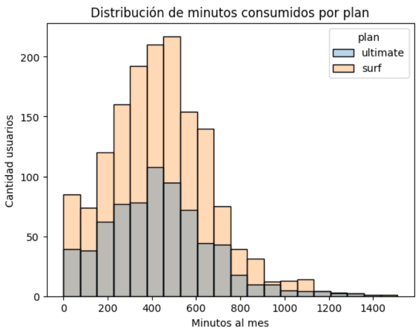
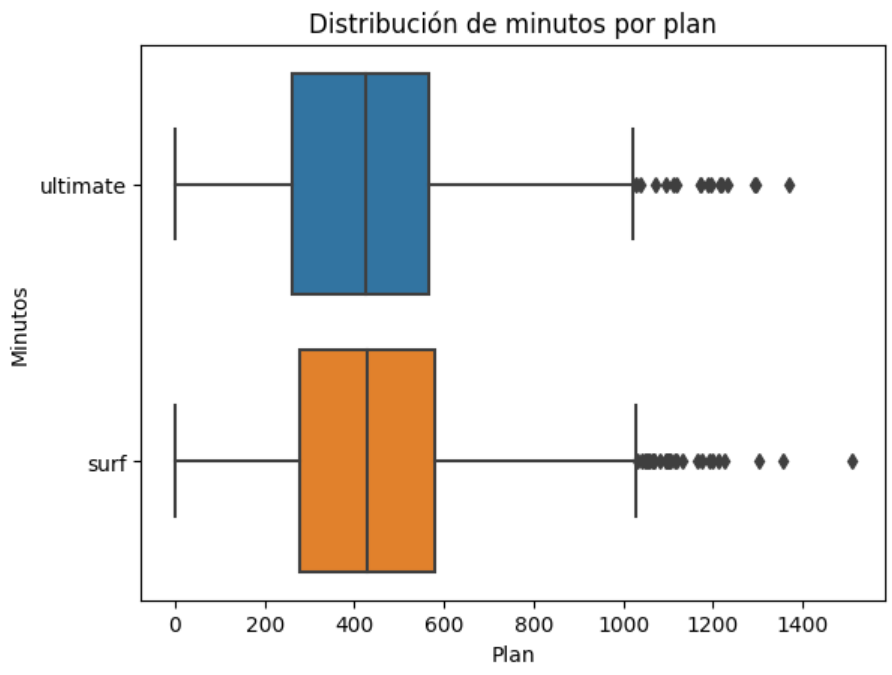
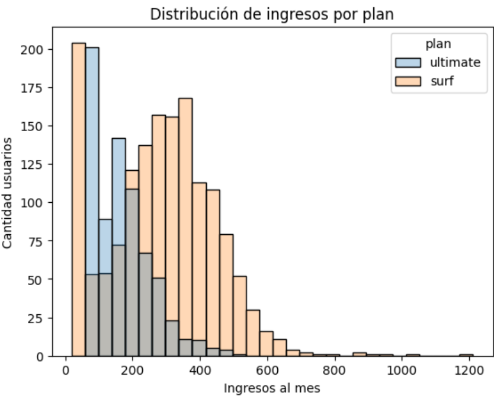

# 02-megaline-revenue-analysis
MEGALINE REVENUE ANALYSIS

## Descripción del proyecto
Análisis del comportamiento de usuarios de una empresa de telecomunicaciones para determinar qué plan prepago genera mayor ingreso, utilizando análisis estadístico.

## Problema de negocio
La empresa necesita decidir:
- Qué plan promocionar
- Cómo optimizar ingresos
- Cómo segmentar clientes

## Objetivo
Determinar qué plan (Surf vs Ultimate) genera mayor ingreso promedio por usuario mediante análisis estadístico.

## Mi contribución
- Construcción del cálculo de ingresos por usuario
- Ingeniería de variables (uso mensual, revenue)
- Análisis comparativo entre planes
- Aplicación de pruebas de hipótesis

## Feature Engineering
- Minutos por usuario/mes
- SMS por usuario/mes
- Consumo de datos mensual
- Ingreso mensual por cliente

## Análisis realizado
- Distribución de uso (minutos, datos, SMS)
- Comparación entre planes
- Análisis de ingresos por usuario

## Análisis estadístico
- Prueba de hipótesis (t-test)
- Nivel de significancia: 0.05

## Insights clave
- El plan Ultimate genera mayor ingreso promedio
- Usuarios de Surf exceden límites con mayor frecuencia
- Alta variabilidad en consumo de datos

## Impacto en negocio
- Optimización de estrategias de pricing
- Mejora en segmentación de clientes
- Soporte para decisiones de marketing

## Enfoque financiero (MUY fuerte aquí)
- Cálculo de revenue real por usuario
- Identificación de clientes más rentables
- Base para proyecciones de ingresos

## Tecnologías
- Python
- Pandas
- NumPy
- SciPy
- Matplotlib

## Evidencia visual

Representa la comparación del número de minutos mensuales que necesitan los usuarios de cada plan:

Diagrama de caja que representa la distribución de minutos por plan:

Representa la distribución del ingreso mes por mes de cada plan:

## Aprendizajes
- Aplicación de estadística en decisiones reales

•	Cómo convertir datos en revenue
•	Importancia del análisis comparativo
